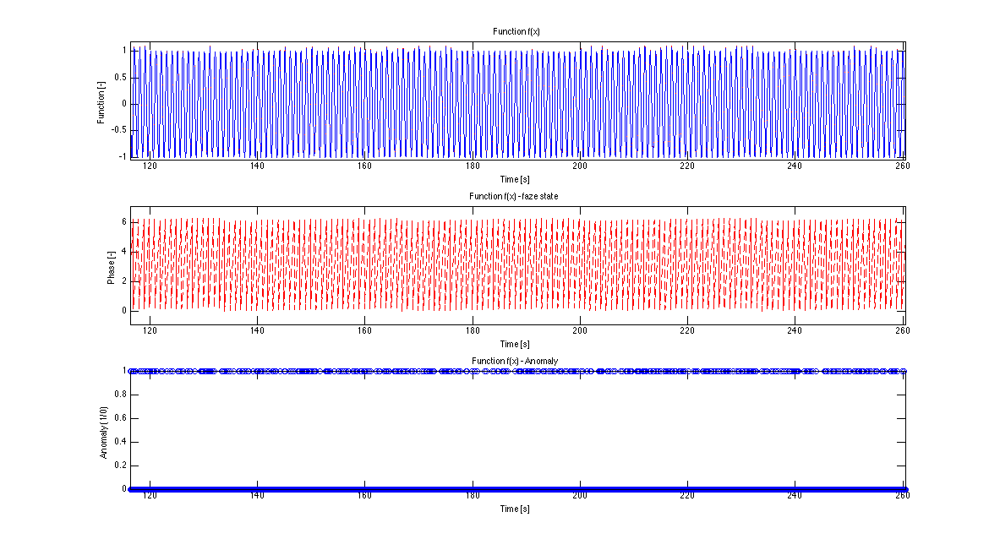
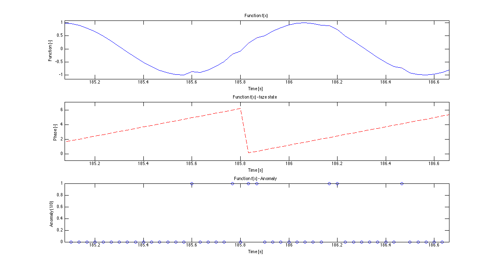

# Corrupted data - point anomaly in amplitude

An anomaly is added to an original neat data. In point anomalies we increase the amplitude of the signal by 20% randomly (the parameter here is 'a density of the anomaly'). 

The density of an anomaly is considered as probability p that an anomaly
would occur in a sample. The general density, say in a period, has
bionomial distribution with a parameter p. Since it is computationally
costly to work with binomial distribution, we decided to use a
probability of the single error instead.

The Good values of the anomaly density are in the range from 0.001 to 0.1. Mind the fact that it heavily depends on the character of data.

 
 

## Parameters
- sampling frequency : 30 Hz
- functions frequency : 1.001 Hz (Why we do so is explained in data/README.md)
- length : specified in a data file name
- anomaly : point anomaly
