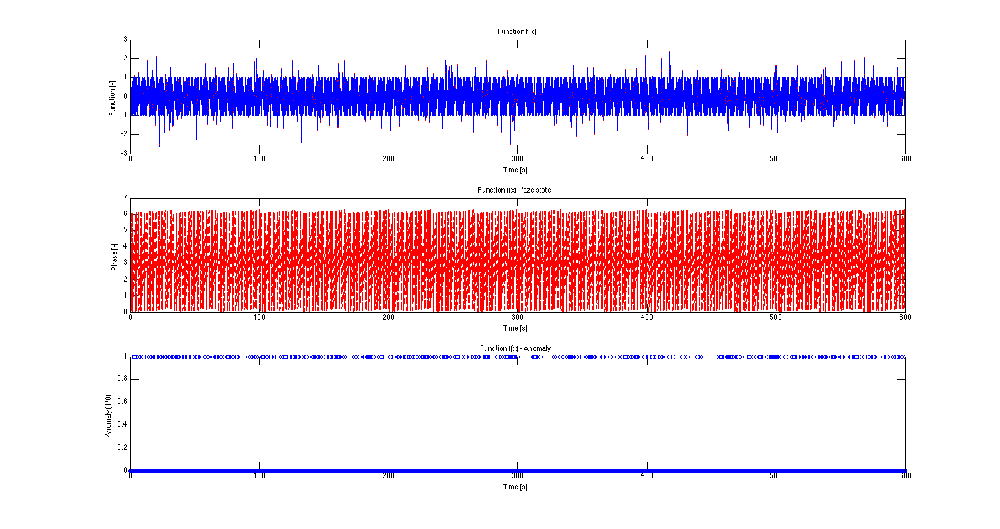
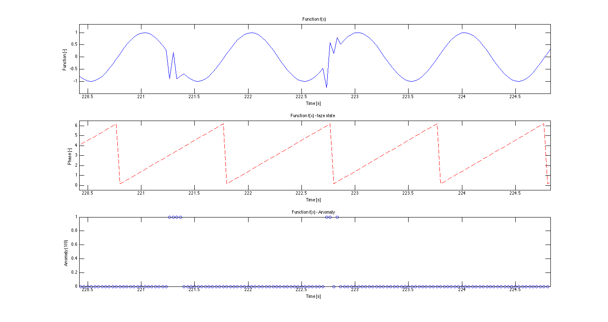

# Corrupted data - section anomaly, simulated data loss

We want to simulate a sensor that occasionally measures incorrectly. 

However, this is the initial motivation and the data loss anomaly is applicable to various problems. For instance, a periodic pattern hidden in the data stream is interrupted by a stochastic error which we look for.

This anomaly is applied in two steps.

1) First, we add anomaly for 50 periods.
2) We maintain anomaly silence for 100 periods.

Note: If you do not understand the process, please check the data/datasets/corruptedData/sectionAnomaly/README.md.

 
 

## Parameters
- sampling frequency : 30 Hz
- functions frequency : 1.001 Hz (Why we do so is explained in data/README.md)
- length : specified in a data file name
- anomaly : section anomaly
- anomaly applied : 50 periods
- followed by silence : 100 periods
